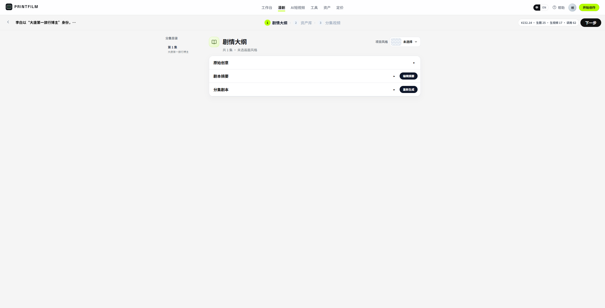
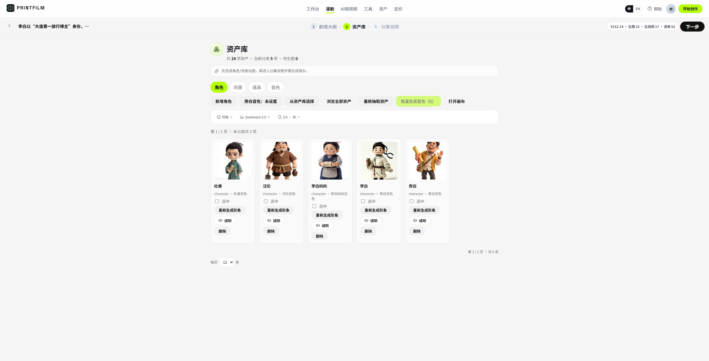
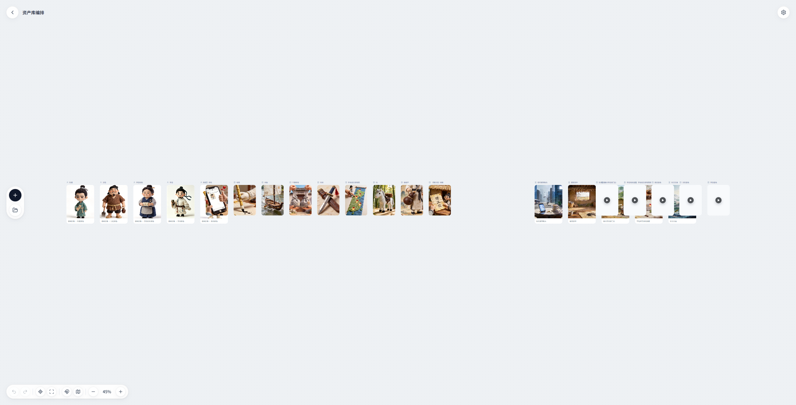

# PRINTFILM

**开源项目**：PRINTFILM
**版本**：0.2.0 | **更新**：2026-09-10

Open-source AI studio for short videos and episodic comics: theme → storyboard → image → video → voice → final cut.

模板驱动的 AI 短视频与漫剧创作平台。同一条生成流水线，多套视觉风格；支持注册登录、按量计费、管理后台与对外开放 API。


| 层级 | 技术选型 |
|------|----------|
| 后端 | Python 3.12 · FastAPI · SQLAlchemy · PostgreSQL |
| 用户端 | React 19 · TypeScript · Vite 8 |
| 管理端 | React 19 · Tailwind · shadcn/ui（开发端口 5174） |
| AI | 文字：OpenAI 兼容（Kimi / DeepSeek 等）；生图/生视频：火山方舟 Seedream / Seedance；配音：豆包 TTS 或 edge-tts |
| 任务 | 应用内 scheduler + executor + poller（随 FastAPI 进程启动） |
| 部署 | Docker 仅跑 Postgres / Redis；应用用本机或服务器进程 |

---

## 目录

- [快速开始](#快速开始)
- [AI 服务配置](#ai-服务配置)
- [操作手册](#操作手册)
  - [1. 系统概述](#1-系统概述)
  - [2. 环境要求](#2-环境要求)
  - [3. 安装与启动](#3-安装与启动)
  - [4. 登录与账号](#4-登录与账号)
  - [5. 界面与模块导航](#5-界面与模块导航)
  - [6. 业务模块操作指南](#6-业务模块操作指南)
  - [7. 典型业务流程](#7-典型业务流程)
  - [8. 系统管理](#8-系统管理)
  - [9. 日常运维](#9-日常运维)
  - [10. 常见问题与排查](#10-常见问题与排查)
  - [11. 附录](#11-附录)
- [贡献](#贡献)
- [开源许可](#开源许可)

---

## 快速开始

仓库不含密钥。先复制示例配置，再启动中间件与三个进程。

```bash
git clone https://github.com/yi1108/printfilm.git
cd printfilm

# 中间件（Postgres 15432 + Redis 16379）
cp deploy/.env.prod.example deploy/.env.prod
# 请把 POSTGRES_PASSWORD 改成自己的强密码
docker compose -f deploy/docker-compose.yml --env-file deploy/.env.prod up -d

# 后端
cd backend
python -m venv .venv
# Windows: .\.venv\Scripts\activate
# Linux / macOS: source .venv/bin/activate
pip install -r requirements.txt
cp .env.example .env
# 编辑 .env：DATABASE_URL 密码与 deploy/.env.prod 一致；填入模型 Key
uvicorn app.main:app --reload --port 8000
```

另开两个终端：

```bash
# 用户端（默认 http://localhost:5173，API 默认走同主机 :8000）
cd frontend
npm install
npm run dev
```

```bash
# 管理后台（http://localhost:5174，已代理 /api → 8000）
cd admin
npm install
npm run dev
```

| 服务 | 地址 |
|------|------|
| 用户端 | http://localhost:5173 |
| 管理后台 | http://localhost:5174 |
| API | http://127.0.0.1:8000 |
| OpenAPI | http://127.0.0.1:8000/docs |
| 健康检查 | http://127.0.0.1:8000/api/health |

| 角色 | 如何获得 |
|------|----------|
| 普通用户 | 打开 `/auth` 自行注册（邮箱 + 密码） |
| 管理员 | 先注册，再在 `backend/.env` 写 `ADMIN_BOOTSTRAP_EMAILS=你的邮箱`，重启后端提权。**不会造号** |

> 仓库没有内置演示账号。生产环境请立即改掉 `SECRET_KEY`、数据库密码与所有 API Key。

**中间件镜像**

```
postgres:16-alpine
redis:7-alpine
```

**项目结构**

```
backend/app/     API、模型、流水线、方舟 / OSS / 计费
frontend/src/    用户端：工作台、漫剧、科普工作室、工具
admin/src/       运营后台：用户 / 订单 / 项目 / 模板 / 设置
deploy/          仅 Postgres + Redis 的 compose
docs/            规范、发布、计费与产品细则
```

**源码地址**：https://github.com/yi1108/printfilm

---

## AI 服务配置

本项目拆成两条上游：**文字**走任意 OpenAI 兼容接口；**生图 / 生视频**走火山方舟。配音优先豆包 openspeech，未配置时回退 `edge-tts`。

也可在管理后台 **系统设置 → 模型路由** 填写渠道（Base URL / Key / 模型），默认文本模型会随渠道同步。`.env` 可作为首次导入。

### 环境变量

编辑 `backend/.env`（变量名以 `.env.example` 为准）：

```env
# 文字模型（OpenAI 兼容）
OPENAI_API_KEY=sk-你的密钥
OPENAI_BASE_URL=https://api.moonshot.cn/v1
MODEL_LLM=kimi-k2.6

# 生图 / 生视频（火山方舟）
ARK_MOCK=false
ARK_API_KEY=你的方舟密钥
MODEL_IMAGE=doubao-seedream-5-0-260128
MODEL_VIDEO=doubao-seedance-2-5-260628
MODEL_AUDIO=seed-tts-2.0
```

| 变量 | 说明 |
|------|------|
| `OPENAI_API_KEY` | 文字模型 Key，勿提交到 Git |
| `OPENAI_BASE_URL` | 兼容接口根地址（示例为 Kimi；也可换 DeepSeek 等） |
| `MODEL_LLM` | 对话 / 分镜脚本模型 |
| `ARK_API_KEY` | 方舟 Key，用于 Seedream / Seedance |
| `ARK_MOCK` | `true` 时走本地 mock 素材，便于无 Key 联调界面 |
| `MODEL_IMAGE` / `MODEL_VIDEO` / `MODEL_AUDIO` | 控制台模型或接入点 ID |
| `VOLC_TTS_API_KEY` | 豆包语音（与方舟 Key 不同）；不配则 edge-tts |

DeepSeek 示例：

```env
OPENAI_API_KEY=sk-xxx
OPENAI_BASE_URL=https://api.deepseek.com
MODEL_LLM=deepseek-chat
```

### 验证

```bash
curl http://127.0.0.1:8000/api/health
```

返回 JSON 中 `ok` 表示任务运行时健康；`models` 为当前 LLM / 图像 / 视频 / 音频模型；`ark_mock` 为是否 mock。

### 常见问题

| 现象 | 处理方法 |
|------|----------|
| 生成无响应或一直排队 | 检查 Key、余额、网络；看 `/api/health` 的 `task_runtime` |
| 401 / 鉴权失败 | Key 无效、过期或渠道 Base URL 写错 |
| 超时 | 调大 `ARK_VIDEO_POLL_TIMEOUT`（默认 900 秒） |
| 只要界面、先不调真模型 | 设 `ARK_MOCK=true` |

---

## 操作手册

### 1. 系统概述

#### 1.1 产品简介

PRINTFILM 面向创作者与运营：输入主题或剧本，按模板生成分镜、画面、旁白与成片。两条主产品线：

- **AI 漫剧**：大纲 → 资产 → 分集分镜 → 画布，强调角色与场景一致性。
- **AI 短视频（科普）**：选模板 → 输入文案 → 风格 → 分镜流水线 → FFmpeg 合成。

另有独立 **工具中心**（文生图、图生图、文生视频等）和可选 **按量钱包**（易支付）。

#### 1.2 核心能力

| 模块 | 说明 |
|------|------|
| 工作台 | 首页选择漫剧 / 短视频 / 工具入口 |
| AI 短视频 | 20+ 内置模板；`full`（含视频）或 `image_text`（静图+旁白） |
| 分镜工作台 | 单张重绘、单镜重生视频、编辑后继续生成 |
| 漫剧 | 剧本摘要、资产库、分集、画布（React Flow） |
| 工具 | 文生图 / 图生图 / 图生产品 / 文生视频 / 视频生视频 / 电商拼图 |
| 资产库 | 角色、场景、道具、音色 |
| 定价与钱包 | 可选；关闭计费时本地可免费试用 |
| 个人中心 | 账号、项目、工具记录、API Key |
| 管理后台 | 用户、订单、财务、项目、模板、任务、模型路由 |
| 开放 API | `/api/v1` 生图 / 生视频（Bearer 或 `X-Api-Key`） |

#### 1.3 技术架构

```
浏览器 (5173 用户端 / 5174 管理端)
        │  /api  ·  /static
        ▼
   FastAPI :8000
        │
        ├── 任务运行时（scheduler / executor / poller）
        ├── PostgreSQL :15432
        ├── Redis :16379（找回密码、缓存等）
        ├── 火山方舟（图 / 视频）+ OpenAI 兼容（文本）
        └── 本地 static/generated + 可选阿里云 OSS
                    │
                    ▼
                 FFmpeg 合成成片
```

工程约定见 [docs/STANDARDS.md](docs/STANDARDS.md)。

---

### 2. 环境要求

| 项 | 要求 |
|----|------|
| Python | 3.12 |
| Node.js | 建议 20+（Vite 8 / React 19） |
| Docker | 20.10+（只跑 Postgres / Redis） |
| FFmpeg | 已加入 PATH（`ffmpeg` / `ffprobe`） |
| 磁盘 | 建议预留数 GB（分镜图、视频片段、成片） |
| 字体（Linux 成片字幕） | 如 `fonts-wqy-zenhei`，否则中文叠字可能变成方框 |

---

### 3. 安装与启动

#### 3.1 本机开发

按 [快速开始](#快速开始) 启动三个进程即可。注意：

1. `deploy/.env.prod` 的数据库密码必须与 `backend/.env` 的 `DATABASE_URL` / `DATABASE_URL_SYNC` 一致。
2. 用户端开发时 **不要** 设置 `VITE_API_BASE`（未设置则访问 `当前主机:8000`）。生产构建必须 `VITE_API_BASE=` 空字符串，走 nginx 同源反代。
3. CORS 默认允许 `localhost:5173` 与 `localhost:5174`，以及局域网私有 IP。

#### 3.2 生产自托管（概要）

线上站点应由 nginx + 进程管理器托管前后端静态资源与 API，**不要**把 SPA 丢到 OSS 当唯一发布方式。OSS 只用于成片 / 分镜等媒体。

要点：

- API：`uvicorn app.main:app --host 0.0.0.0 --port 8000`（建议 `--workers 1`）
- 用户端 / 管理端：`npm ci && npm run build`，静态根分别指向 `frontend/dist`、`admin/dist`
- 生产 `CORS_ORIGINS` 只写真实域名
- 易支付回调 **禁止** 含 `/api/`（部分支付网关 WAF 会拦截），使用 `/epay/notify` 再反代到 `/api/billing/epay/notify`

完整清单见 [docs/DEPLOY.md](docs/DEPLOY.md)、[deploy/README.md](deploy/README.md)。

---

### 4. 登录与账号

**路径**：`/auth`

| 元素 | 说明 |
|------|------|
| 注册 | 邮箱、昵称、密码；成功后直接登录（JWT，默认 7 天） |
| 登录 | 邮箱 + 密码 |
| 找回密码 | 依赖 Redis；未配好 Redis 时该流程不可用 |
| 管理员 | `User.role=admin`；用 `ADMIN_BOOTSTRAP_EMAILS` 提升**已有**用户 |

计费开启时，新用户可获赠 `BILLING_SIGNUP_GRANT_FEN`（示例默认 500 分 = ¥5.00）。本地默认 `BILLING_ENABLED=false`。

---

### 5. 界面与模块导航

用户端顶栏（中 / 英可切换）：

| 菜单 | 路由 | 说明 |
|------|------|------|
| 工作台 | `/` | 产品入口与流程介绍 |
| 漫剧 | `/drama` | 漫剧项目列表 |
| AI短视频 | `/history` | 科普项目历史与进度 |
| 工具 | `/tools` | 单点生成能力 |
| 资产 | `/assets` | 全局资产库 |
| 定价 | `/pricing` | 套餐与充值 |
| 帮助 | `/help` | 上手步骤与 FAQ |
| 个人中心 | `/settings` | 账号、项目、API Key |

管理端侧栏：仪表盘、用户、订单、财务、科普项目、作品、漫剧（项目 / 资产 / 分集 / 分镜）、模板、任务中心、系统设置。

---

### 6. 业务模块操作指南

#### 6.1 工作台

**路径**：`/`

**功能概述**：选择「AI 漫剧」或「AI 短视频」，或进入工具。

| 元素 | 说明 |
|------|------|
| 开始创作 | 未登录跳转 `/auth`；已登录弹出产品选择 |
| 产品卡片 | 分别进入 `/drama` 或科普创建流 |

#### 6.2 AI 短视频（科普）

**路径**：`/studio/new` → `/studio/:id/style` → `/studio/:id` → `/studio/:id/editor`；列表在 `/history`

**功能概述**：主题 / 口播文案经模板拆镜后，生成分镜图、视频（可选）、配音，再 FFmpeg 合成。

| 元素 | 说明 |
|------|------|
| 模板 | 启动时写入库；含剪纸、绘本、粉笔、拼贴、像素、水墨，以及开源展示、真人、电影感等 |
| 管线模式 | `full`：图 + 视频 + 合成；`image_text`：静图 + 旁白，更快更省 |
| 进度 | 服务端状态机：`SCRIPTING` → `IMAGING` → `VIDEOING` / `AUDIOING` → `COMPOSING` → `DONE` |
| 离开页面 | 任务继续跑；回历史页看进度 |
| 成片位置 | 本地 `backend/static/generated/p{id}/`；开启 OSS 后 DB 存公网 URL |


#### 6.3 漫剧

**路径**：`/drama`、`/drama/projects/:projectId`、`/drama/projects/:projectId/episodes/:episodeId`、`/drama/projects/:projectId/canvas`

**功能概述**：从大纲到分集成片，资产可复用到各集。

| 元素 | 说明 |
|------|------|
| 剧情大纲 | 自动摘要 + 分集剧本 |
| 资产库 | 角色 / 场景 / 道具 / 音色绑定 |
| 分集视频 | 分镜编辑、单镜重绘或重生 |
| 画布 | 节点式编排（React Flow），自动保存 |
| 后端 | `/api/drama/*`（项目、剧本、资产、分集、生成、画布、Skill） |







细则见 [docs/EPISODE_RULES.md](docs/EPISODE_RULES.md)、[docs/SHOT_SPLITTING.md](docs/SHOT_SPLITTING.md)。

#### 6.4 创作工具

**路径**：`/tools`、`/tools/:toolId`

**功能概述**：不走完整短视频流水线的单点生成。

| 工具 ID | 能力 |
|---------|------|
| `t2i` | 文生图 |
| `i2i` | 图生图 |
| `i2p` | 图生产品（白底 / 场景 / 详情） |
| `t2v` | 文生视频（先静帧再 Seedance） |
| `v2v` | 视频生视频 |
| `ecom` | 电商拼图 |

生图走统一任务平台；生视频返回任务 ID 供前端轮询。记录在个人中心「工具创作」。

#### 6.5 定价与钱包

**路径**：`/pricing`

**功能概述**：按上游 token（或估价）× 加价倍率扣费；充值走易支付。

本地默认关闭。开启后详见 [docs/BILLING.md](docs/BILLING.md)。

```env
BILLING_ENABLED=true
BILLING_MARKUP=1.5
EPAY_API_URL=https://pay.gitcc.com
EPAY_PID=
EPAY_KEY=
# 生产 notify 不要带 /api/
# EPAY_NOTIFY_URL=https://your-site.example.com/epay/notify
```

#### 6.6 个人中心与开放 API

**路径**：`/settings`

| Tab | 说明 |
|-----|------|
| 账号 / 安全 | 资料、改密 |
| 漫剧 / 科普 / 工具 | 项目与创作记录、下载 |
| API | 创建 API Key，调用 `/api/v1/images/generations`、`/api/v1` 视频接口 |
| 团队 / 通知 | 占位，尚未开放 |

鉴权：`Authorization: Bearer <token>` 或 `X-Api-Key`。

---

### 7. 典型业务流程

#### 7.1 做一条科普短视频

```
注册登录 → 工作台选 AI 短视频 → 选模板与管线
  → 填写主题 / 口播 → 风格配置 → 开始生成
  → 分镜页审阅（可单镜重绘 / 重生）
  → 合成完成后在历史页下载
```

#### 7.2 做一部漫剧

```
/drama 新建项目 → 大纲（摘要 + 分集）
  → 资产（角色外形 / 场景 / 音色）
  → 进入分集编辑或画布
  → 分镜出图 / 出视频 → 工作台查看成片
```

#### 7.3 只要一张图或一段视频

```
/tools 选能力 → 填提示词或上传参考 → 生成
  → 个人中心回看与下载
```

---

### 8. 系统管理

独立前端，开发端口 **5174**。管理员与用户共用登录接口，需 `role=admin`。

| 路径 | 功能 |
|------|------|
| `/` | 仪表盘：用量趋势、分布、头部用户 |
| `/users` | 用户列表与详情（服务端分页） |
| `/orders` `/finance` | 订单与财务流水 |
| `/projects` `/works` | 科普项目、作品审核 |
| `/drama-projects` 等 | 漫剧项目 / 资产 / 分集 / 分镜 |
| `/templates` | 模板管理 |
| `/queues` | 任务中心（统一任务平台） |
| `/settings` | 模型路由、运行参数、OSS、支付计费、站点 / FFmpeg 路径 |

密钥在后台保存时加密入库；留空再保存表示不修改原值。


---

### 9. 日常运维

#### 9.1 健康检查

```bash
curl http://127.0.0.1:8000/api/health
```

关注 `ok`、`task_runtime`、`db_pool`、`models`。

#### 9.2 日志与重启

- 开发：看 uvicorn / Vite 终端
- 中间件：`docker compose -f deploy/docker-compose.yml --env-file deploy/.env.prod logs -f`
- 重启 API 即可重载大部分 `.env`；管理员提权必须重启一次

#### 9.3 备份

- Postgres 数据卷：`ai_movie_pgdata`
- Redis 卷：`ai_movie_redisdata`
- 本地媒体：`backend/static/generated/`
- 停中间件不删数据：`docker compose ... down`；清库才加 `-v`

#### 9.4 并发与存储

| 变量 | 含义 |
|------|------|
| `TASK_RUNTIME_MAX_CONCURRENCY` | 全站进程内 Worker 槽位 |
| `TASK_USER_MAX_CONCURRENCY` | 单用户同时占用的槽位 |
| `PIPELINE_IMAGE_CONCURRENCY` 等 | 单项目内图 / 视频 / 音频并发 |
| `OSS_ENABLED` | 成片与分镜上传对象存储；FFmpeg 仍读本地文件 |

#### 9.5 更新

拉代码 → `pip install -r requirements.txt` → 两端 `npm install`（如有依赖变更）→ 重启 API。启动时会跑 schema 补丁、模板 seed 与管理员 bootstrap。线上发布记录见 [docs/releases/](docs/releases/)。

---

### 10. 常见问题与排查

| 类别 | 现象 | 处理 |
|------|------|------|
| 访问 | 前端能开但接口失败 | 确认 API 在 8000；用户端未误设生产空 `VITE_API_BASE` |
| 登录 | 管理端 403 | 账号尚未 admin；检查 `ADMIN_BOOTSTRAP_EMAILS` 后重启 |
| 部署 | 数据库连不上 | 端口 15432、密码与 compose 一致、容器 healthy |
| 部署 | Redis 连不上 | 应用默认示例为 `16379`；`config.py` 回退值是 `6379`，以 `.env` 为准 |
| AI | 分镜/视频失败 | Key、模型 ID、方舟额度；先看任务中心与后端日志 |
| 成片 | 有视频无中文字幕 | 安装中文字体后重新合成 |
| 支付 | 回调失败 | notify URL 不要包含 `/api/` |
| 安全 | 误提交密钥 | 轮换 Key；确认 `.env`、`deploy_kepu.py`、`.tmp/` 在 gitignore 中 |

---

### 11. 附录

#### 11.1 环境变量速查

| 变量 | 默认 / 示例 | 说明 |
|------|-------------|------|
| `SECRET_KEY` | `dev-secret-change-me` | JWT 签名，生产必改 |
| `DATABASE_URL` | `postgresql+asyncpg://printfilm:…@127.0.0.1:15432/printfilm` | 异步库 |
| `DATABASE_URL_SYNC` | `postgresql+psycopg2://…` | 同步库 |
| `REDIS_URL` | `redis://127.0.0.1:16379/0` | 缓存 / 找回密码 |
| `CORS_ORIGINS` | `http://localhost:5173,…5174` | 逗号分隔 |
| `PUBLIC_BASE_URL` | `http://127.0.0.1:8000` | 对外回链根 |
| `ADMIN_BOOTSTRAP_EMAILS` | （空） | 启动提权邮箱 |
| `ARK_*` / `OPENAI_*` / `MODEL_*` | 见 `.env.example` | 模型 |
| `BILLING_*` / `EPAY_*` | 默认关闭计费 | 钱包与支付 |
| `OSS_*` | 默认关闭 | 对象存储 |
| `FFMPEG_PATH` / `FFPROBE_PATH` | `ffmpeg` / `ffprobe` | 也可在管理端「站点工具」改 |

完整列表以 `backend/.env.example` 与 `deploy/.env.prod.example` 为准。**不要**把真实 Key 写入文档或 Git。

#### 11.2 相关文档

| 文档 | 内容 |
|------|------|
| [docs/STANDARDS.md](docs/STANDARDS.md) | 工程规范 |
| [docs/DEPLOY.md](docs/DEPLOY.md) | 线上发布 |
| [docs/BILLING.md](docs/BILLING.md) | 计费公式与易支付 |
| [docs/EPISODE_RULES.md](docs/EPISODE_RULES.md) | 漫剧分集规范 |
| [docs/SEEDANCE_2_5.md](docs/SEEDANCE_2_5.md) | Seedance 参数 |
| [deploy/README.md](deploy/README.md) | 中间件与本机运维 |

#### 11.3 截图索引

| 界面 | 文件 |
|------|------|
| 工作台 | `docs/images/image-20260910-home.png` |
| 剧情大纲 | `docs/images/image-20260910-drama.png` |
| 漫剧资产库 | `docs/images/image-20260910-drama-assets.png` |
| 漫剧画布 | `docs/images/image-20260910-drama-canvas.png` |
| 科普历史 | `docs/images/image-20260910-history.png` |
| 分镜工作台 | `docs/images/image-20260910-studio.png` |
| 成片预览 | `docs/images/image-20260910-preview.png` |
| 管理后台 | `docs/images/image-20260910-admin.png` |

---

## 贡献

欢迎 Issue 与 Pull Request。提交前请对照 [docs/STANDARDS.md](docs/STANDARDS.md)：

- 用户可见文案用简体中文；函数 / 组件顶部加功能注释
- 列表筛选与分页走服务端
- 不要提交 `.env`、密钥、`deploy/scripts/deploy_kepu.py`、`.tmp/`、生成媒体
- 单文件尽量不超过 500 行，公共逻辑放到 `lib/` / `services/` / `components/`

```bash
# 后端（在 backend/ 下）
# 前端
cd frontend && npm run lint
cd ../admin && npm run lint
```

---

## 开源许可

本项目采用 [MIT License](LICENSE)。

---

**PRINTFILM**
文档版本：0.2.0 | 2026-09-10
