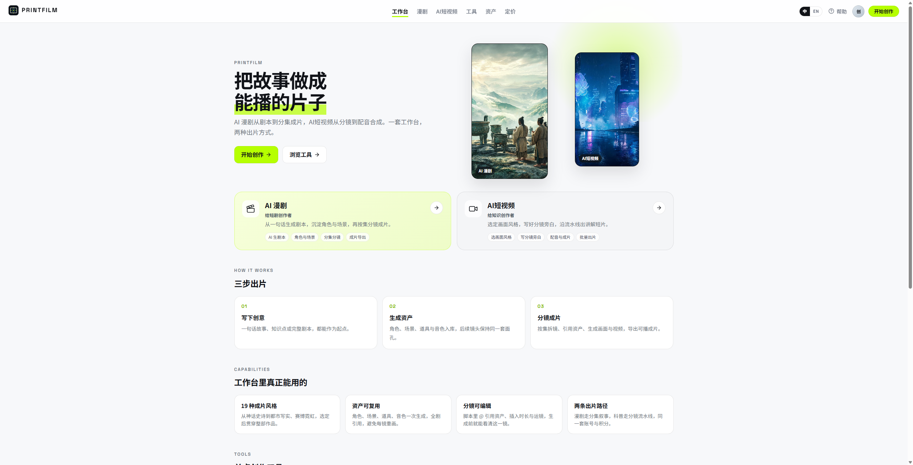
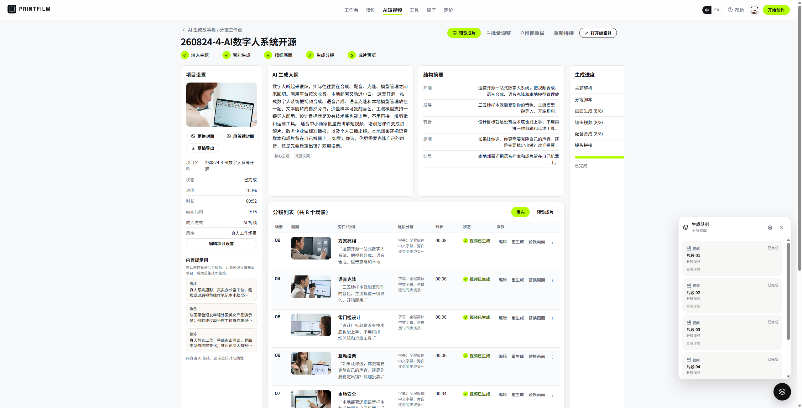
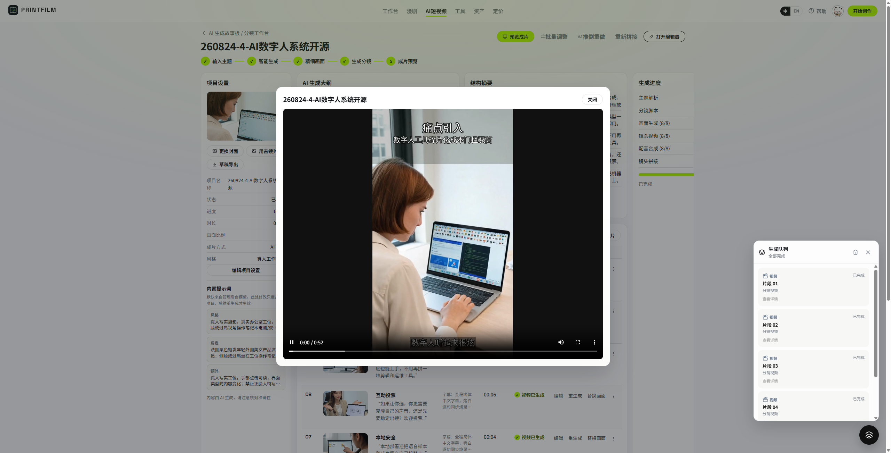
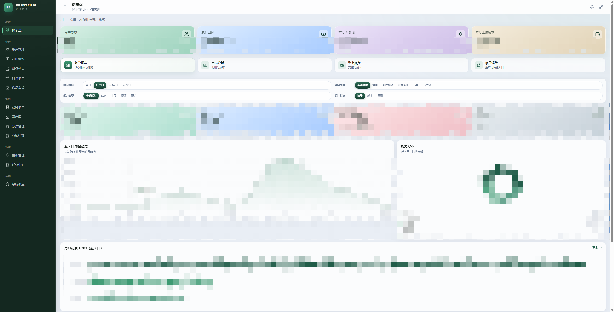

# PRINTFILM

**Languages:** [中文](README.md) | [English](README_EN.md)

[](https://github.com/yi1108/printfilm)
[](LICENSE)

> **Turn stories into videos you can ship** — AI short drama and AI short video, from script to final cut.

A template-driven creation platform: topic / script → storyboard → image gen → video gen → final compose. Voice-over is generated with Seedance at render time — no separate TTS step.

**Source:** [github.com/yi1108/printfilm](https://github.com/yi1108/printfilm) · **Version** 0.2.0

## Screenshots

**Studio**



**AI short video** — history, storyboard, final cut

| Project history | Storyboard studio | Final preview |
|:---:|:---:|:---:|
|  |  |  |

**AI short drama** — projects, episodes, scripts, storyboards, assets

| Project list | Episode workspace | Script parse |
|:---:|:---:|:---:|
|  |  |  |

| Storyboard edit | Asset library | Admin |
|:---:|:---:|:---:|
|  |  |  |

## Core features

### 1. AI short drama

From a one-liner to episode-ready video, with reusable characters and scenes.

- Outline / plot summary / full script
- Asset library: characters, scenes, props
- Parse into shots, then edit on the storyboard canvas
- Details: [docs/EPISODE_RULES.md](docs/EPISODE_RULES.md)

### 2. AI short video

Pick a template and run the storyboard pipeline — good for marketing and explainers.

- 20+ built-in style templates
- `full` (image + video + compose) or `image_text` (stills — faster and cheaper)
- Per-shot redraw / regenerate video; jobs keep running after you leave the page
- Final cut composed with FFmpeg

### 3. Tools hub

One-shot capabilities without the full pipeline: text-to-image, image-to-image, image-to-product, text-to-video, video-to-video, e-commerce collage.

### 4. Admin console and open API

Users, orders, templates, task center, model routing. Open API `/api/v1` for image / video generation (Bearer or `X-Api-Key`).

## Workflow

```
Enter a topic or script
    → Storyboard
    → Image generation
    → Video generation (Seedance includes voice-over)
    → FFmpeg final compose
```

You can redo any single shot at each stage; progress shows on the history page.

## Technical highlights

- **Two product lines, one generation stack** — drama and short video share the same upstream
- **In-process task platform** — scheduler / executor / poller; no separate Celery worker
- **Swappable models** — configure TokenFree keys and models in admin; no code changes
- **One-command Docker** — public images, pull without login
- **Optional billing** — off by default; usage-based when enabled — see [docs/BILLING.md](docs/BILLING.md)

## Tech stack

| Layer | Stack |
|-------|-------|
| Backend | Python 3.12 · FastAPI · SQLAlchemy · PostgreSQL · Redis |
| Frontend | React 19 · TypeScript · Vite 8 (admin: Tailwind + shadcn) |
| AI | TokenFree New API (text / image / video) |
| Deploy | Full-stack Docker images, or local three processes + middleware containers |

## Quick start (Docker)

You only need [Docker Desktop](https://www.docker.com/products/docker-desktop/) (or Docker Engine + Compose). Images live in Aliyun ACR `gcc` public namespace — **no login required to pull**.

### 1. Clone and prepare env

```bash
git clone https://github.com/yi1108/printfilm.git
cd printfilm

cp deploy/.env.docker.example deploy/.env.docker
```

Edit `deploy/.env.docker` and change at least these three:

| Variable | Notes |
|----------|-------|
| `POSTGRES_PASSWORD` | DB password (do not keep the example default) |
| `SECRET_KEY` | Long random string (session / key encryption) |
| `OPENAI_API_KEY` / `ARK_API_KEY` | TokenFree API Key (same key in both fields) |

No key yet, just want the UI? Set `ARK_MOCK=true`.

### 2. Start

```bash
docker compose --env-file deploy/.env.docker up -d
```

Wait about half a minute (web / admin start after the API health check passes).

| Service | URL |
|---------|-----|
| App | http://localhost:8080 |
| Admin | http://localhost:8081 |
| API / docs | http://localhost:8000 · `/docs` |
| Health | http://localhost:8000/api/health |

Common commands:

```bash
docker compose --env-file deploy/.env.docker ps          # status
docker compose --env-file deploy/.env.docker logs -f api # logs
docker compose --env-file deploy/.env.docker down        # stop (keep volumes)
```

### 3. Register and admin

| Role | How |
|------|-----|
| User | Open the app → `/auth` and register with email |
| Admin | Register that email first → set `ADMIN_BOOTSTRAP_EMAILS=your@email` in `.env.docker` → `docker compose --env-file deploy/.env.docker up -d --force-recreate api` (**promotes only; does not create accounts**) |

No built-in demo accounts; change secrets immediately for production.

### 4. Update to latest images

```bash
docker compose --env-file deploy/.env.docker pull
docker compose --env-file deploy/.env.docker up -d
```

### 5. Build from source (optional)

When you changed frontend/backend code, or cannot pull from ACR:

```bash
docker compose --env-file deploy/.env.docker -f docker-compose.full.yml up -d --build
```

## Configure TokenFree API Key

The open-source build routes text / image / video through **TokenFree New API** (OpenAI-compatible: `https://www.tokenfree.com/v1`). Without a key you can only use `ARK_MOCK=true` for the UI — real generation will not work.

### A. Get a key from TokenFree

1. Open [https://www.tokenfree.com](https://www.tokenfree.com) and sign in.
2. Go to **API keys / Tokens** in the console (some deployments use `/token` or `/keys`).
3. Click **Create**, name it (e.g. `printfilm`), set quota / expiry as needed.
4. **Copy the full key immediately** (looks like `sk-…`, shown once).
5. Confirm the account has balance/quota and the models you need appear in the list.

> Treat the key like a password. Do not commit it to Git or paste it in chat. If leaked, revoke and recreate it in the TokenFree console.

### B. Write into Docker env (recommended for first self-host)

Edit `deploy/.env.docker`:

```env
OPENAI_API_KEY=sk-your-key
OPENAI_BASE_URL=https://www.tokenfree.com/v1
ARK_API_KEY=sk-your-key
ARK_MOCK=false
MODEL_LLM=kimi-k2.6
MODEL_IMAGE=seedream-5-0-pro
MODEL_VIDEO=seedance-2-5
```

Use the **same** value for `OPENAI_API_KEY` and `ARK_API_KEY`. Recreate the API container:

```bash
docker compose --env-file deploy/.env.docker up -d --force-recreate api
```

Open http://localhost:8000/api/health — `ark_mock` should be `false`.

### C. Set key in admin (recommended for day-to-day key changes)

1. Log in as admin at http://localhost:8081 .
2. Open **System settings → Models** (routing / TokenFree channel).
3. Paste the API Key into the TokenFree channel and save.
4. Adjust default text / image / video models as needed; changes apply immediately — usually no `.env` edit required.

Keys saved in admin are encrypted in the database; when migrating hosts, back up the DB or re-enter the key.

### D. Troubleshooting

| Symptom | Fix |
|---------|-----|
| Image / video says key not configured | Check `.env.docker` is not still `replace-me`, or that the admin channel has a key |
| `ark_mock: true` | Set `ARK_MOCK=false`, ensure key is non-empty, then `--force-recreate api` |
| 401 / insufficient quota | Check key status and balance in TokenFree console |
| Model 404 | Pick a model id that TokenFree actually lists in admin |

## Use cases

- Short video / acquisition clips: turn selling points into ad-ready shorts
- Short drama: outline to episodes with consistent characters and scenes
- One-shot image/video: generate directly from the tools hub
- Self-host: pull Docker images and run on your own machine

## Layout

```
backend/                  FastAPI, pipeline, billing, task runtime
frontend/                 User app
admin/                    Ops console
deploy/                   Env examples, middleware compose
docs/                     Standards and topic docs
docker-compose.yml        One-command public images
docker-compose.full.yml   Build from source
```

## Community

- GitHub: https://github.com/yi1108/printfilm
- WeChat: add **`gitpp88`** (note “join group”): deploy help / drama chat / template sharing

## Star History

[](https://www.star-history.com/#yi1108/printfilm&Date)

## More docs

| Doc | Content |
|-----|---------|
| [docs/STANDARDS.md](docs/STANDARDS.md) | Engineering standards |
| [docs/BILLING.md](docs/BILLING.md) | Billing and Epay |
| [docs/EPISODE_RULES.md](docs/EPISODE_RULES.md) | Drama episode rules |
| [docs/SEEDANCE_2_5.md](docs/SEEDANCE_2_5.md) | Seedance parameters |
| [deploy/README.md](deploy/README.md) | Local middleware and ops |

## Contributing

Issues / PRs welcome. Before submitting, follow [docs/STANDARDS.md](docs/STANDARDS.md): Simplified Chinese product copy, function comments, server-side pagination; do not commit `.env`, secrets, or generated media.

```bash
cd frontend && npm run lint
cd ../admin && npm run lint
cd ../backend && pytest
```

## License

[MIT License](LICENSE).
