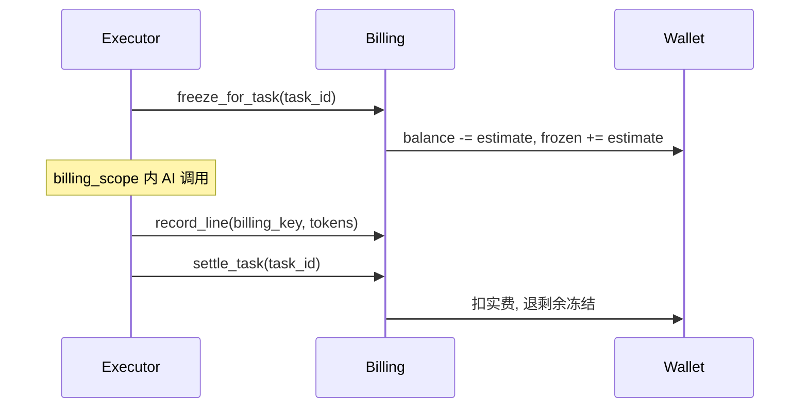

# PRINTFILM 计费说明

## 原则

- 按上游 **真实 token 用量**（或无法拿到 usage 时的保守估价）计费。
- 用户支付价 = 上游成本 × **1.5**（`BILLING_MARKUP`）。
- 钱包单位：**分（fen）**。
- 充值：易支付 [pay.gitcc.com](https://pay.gitcc.com/)，支付宝 `alipay` / 微信 `wxpay`。
- **所有 AI 调用**均关联 `task_run_id`（单次聊天/API/工具调用创建轻量 TaskRun）。

## 公式

```
charge_fen = ceil(tokens / 1e6 * provider_yuan_per_m * markup * 100)
```

默认成本价（元/百万 tokens，可环境覆盖）：

| billing_key | 成本 |
|-------------|------|
| seedance2:video0 | 46 |
| seedance2:video1 | 28 |
| llm_chat | 5 |
| seedream | 8（按次折合约；有 usage 则用 usage） |
| tts | 2（按次估价） |

Seedance 视频任务成功后，优先读取官方「查询视频生成任务」响应中的 `usage.total_tokens` 写入 `usage_events`（`estimated=false`）；仅在上游未返回 usage 时回退到时长估算。

管理端「官方用量对照」需配置 `VOLC_ACCESS_KEY_ID` / `VOLC_SECRET_ACCESS_KEY`，通过方舟管控面 `GetInferenceUsage` 拉取账号日用量并与本地 seedance 成本对照。

## TaskRun 计费流程

每个 `TaskRun` 独立走「预扣 → 记录用量 → 结算」：



### 关键字段

**`usage_events`**（用量行）：

| 字段 | 说明 |
|------|------|
| `task_run_id` | 关联 `task_runs.id`（历史数据可空） |
| `domain` | `kepu` / `drama` / `studio` / `api` |
| `capability` | `llm` / `image` / `video` / `tts` |
| `estimated` | 无上游 usage 时为 `true` |
| `settled` | 任务结算后标记 |

**`task_runs`**（计费快照）：

| 字段 | 说明 |
|------|------|
| `billing_estimate_fen` | 预扣估算额 |
| `billing_charged_fen` | 结算实扣额 |
| `billing_refunded_fen` | 结算退回额 |
| `billing_status` | `none`（未预扣）/ `frozen` / `settled` / `skipped`（预扣时跳过，结算后变 `settled`） |

**`wallet_ledger`**：`ref_type=task_run`、`ref_id={task_id}` 记录 freeze / unfreeze / settle。

### 模块入口

| 场景 | 计费方式 |
|------|----------|
| 科普 pipeline / 单镜重生 | 任务平台 executor 自动 freeze/settle |
| 漫剧剧本/分镜/资产（异步） | `create_task` 入队，handler 内 `record_line` |
| 漫剧聊天 / Skill 优化 / 音色描述 | `run_billed_ephemeral`（见下表） |
| 科普选题扩写 | `run_billed_ephemeral(domain=kepu, content_expand)` |
| 漫剧资产 seed（轻量同步） | `run_billed_ephemeral(domain=drama, seed_assets)` |
| 工作室工具 | `run_billed_ephemeral(domain=studio, tool_image/tool_video)` |
| 开放 API | `run_billed_ephemeral(domain=api, v1_image/v1_video/v1_seedance)` |

### LLM 操作全清单（`billing_key=llm_chat`）

| 用户功能 | domain | task_type | 模式 |
|----------|--------|-----------|------|
| 科普选题扩写 | `kepu` | `content_expand` | 同步 ephemeral |
| 科普分镜编剧 | `kepu` | `project_pipeline`（script 阶段） | 异步任务 |
| 漫剧助手聊天 | `drama` | `agent_chat` | 同步 ephemeral |
| Skill 优化提示词 | `drama` | `skill_optimize` | 同步 ephemeral |
| 角色音色描述 | `drama` | `voice_prompt` | 同步 ephemeral |
| 剧本摘要 | `drama` | `script_summary` | 异步任务 |
| 分集大纲 + 分集正文 | `drama` | `episode_script` | 异步任务（大纲与每集各记 llm_chat） |
| AI 分镜 | `drama` | `fragment_plan` | 异步任务 |
| 资产抽取 / 刷新提示词 | `drama` | `seed_assets` | 异步或同步 ephemeral |
| 资产生图前视觉提示词 LLM | `drama` | `asset_image` / `fragment_video` 等 | 嵌套于父任务 billing_scope |

嵌套 LLM（如 `visual_prompt`）在父任务 `billing_scope` 内通过 `record_llm_chat_line` 追加用量行；无 scope 时由 seed 等路径聚合计费，避免重复。

**不计 LLM 的场景**：分镜规则回退（`rules_fallback`）、分集大纲已就绪跳过大纲 LLM、Skill 优化未勾选任何 Skill。

科普分阶段：`project_pipeline` 的 `script` / `assets` / `videos` 各对应一次 TaskRun，各自独立预扣与结算（旧 payload `produce` 兼容映射为当前下一段）。成片走 `project_compose_only`（几乎不预扣）。阶段判定与 pipeline 共用 `kepu_stages`（含整片旁白文件就绪）。

`awaiting_poll` 分镜视频：executor 提前返回时不结算；轮询完成标 `succeeded` 时 `settle_task`。

余额不足：`freeze_for_task` 失败 → HTTP 402（`create_task` 入队前同步预检，或轻量任务预扣失败）。

全局关闭计费（`BILLING_ENABLED=false`）：预扣时 `billing_status=skipped`（不冻钱包）；`settle_task` 后标 `settled`，usage 行 `settled=true`（仅统计，不扣钱包）。

余额不足失败：`billing_status` 保持 `none`（未成功预扣，勿与全局关闭计费的 `skipped` 混淆）。

api/studio 轻量视频：`awaiting_poll` 由 Selector 后台轮询；超过 `ark_video_poll_timeout` 自动失败并解冻。

## 易支付

环境变量（密钥勿提交仓库）：

```
BILLING_ENABLED=true
BILLING_MARKUP=1.5
EPAY_API_URL=https://pay.gitcc.com
EPAY_PID=your-epay-pid
EPAY_KEY=***
EPAY_NOTIFY_URL=https://your-site.example.com/epay/notify
EPAY_RETURN_URL=https://your-site.example.com/pricing?paid=1
```

下单：服务端 `POST {EPAY_API_URL}/mapi.php`（扫码），MD5 签名。异步 notify 验签成功 → 订单入账（幂等）。

## API

| 方法 | 路径 | 说明 |
|------|------|------|
| GET | `/api/billing/usage/summary` | 本月 token / 费用 / 余额 |
| GET | `/api/billing/orders` | 充值订单列表 |
| POST | `/api/billing/orders` | `{sku_id, pay_type}` → 扫码支付 |
| POST | `/api/billing/epay/notify` | 易支付回调 |
| GET | `/api/admin/usage-events` | 管理端用量明细分页 |
| GET | `/api/admin/tasks/{id}` | 任务详情含 `usage_lines` 与计费字段 |
| GET | `/api/admin/stats/upstream-usage` | 近 N 日官方/本地 seedance 成本对照 |
| POST | `/api/admin/stats/upstream-usage/sync` | 手动刷新官方用量快照 |

## 管理端

- **订单与流水** → 「用量明细」Tab：按用户/任务/领域筛选 `usage_events`。
- **任务队列** → 列表「费用」列显示 `billing_charged_fen`（冻结中显示预扣）。
- **任务详情** → 「计费」Tab：预扣/实扣/退回 + 用量行列表。
- **仪表盘** → 「Seedance 官方用量对照」：本地成本 vs 方舟 `GetInferenceUsage`（需 `VOLC_ACCESS_KEY_ID` / `VOLC_SECRET_ACCESS_KEY`）。

## 验收清单

1. 科普：确认分镜只冻出图+配音；继续生成视频另冻视频段；合成走 compose。各阶段任务结束按实际用量结算。
2. 漫剧分镜视频/资产生成：有 `task_run_id` 的用量行，任务结束扣费。
3. 漫剧聊天 / 选题扩写 / Skill 优化 / 音色描述 / 开放 API / 工作室工具：响应含 `task_id`（轻量 TaskRun），余额变化正确。
4. 管理端可按 `task_run_id` 或 `billing_key=llm_chat` 查到每条 LLM/图/视频/TTS 费用。
5. Seedance 视频成功后 `usage_events.estimated=false` 且 `total_tokens` 与官方任务查询一致。
6. 配置火山 AK/SK 后，管理端可刷新并查看近 30 日官方/本地成本对照。
